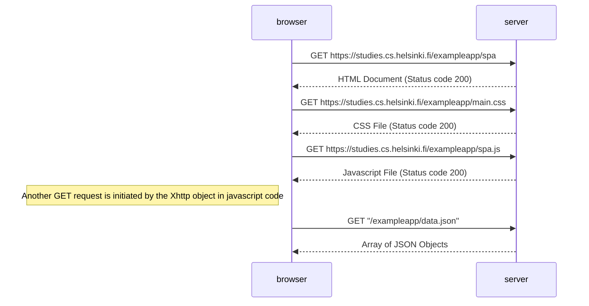

```mermaid
sequenceDiagram
  participant browser
  participant server


  browser->>server: GET https://studies.cs.helsinki.fi/exampleapp/spa
  server-->>browser: HTML Document (Status code 200)

  browser->>server: GET https://studies.cs.helsinki.fi/exampleapp/main.css
  server-->>browser: CSS File (Status code 200)

  browser->>server: GET https://studies.cs.helsinki.fi/exampleapp/spa.js
  server-->>browser: Javascript File (Status code 200)

  Note left of browser: Another GET request is initiated by the Xhttp object in javascript code

  browser->>server: GET "/exampleapp/data.json"
  server-->>browser: Array of JSON Objects
```
