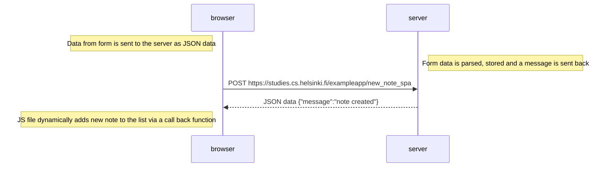

```mermaid
sequenceDiagram
  participant browser
  participant server

  Note left of browser: Data from form is sent to the server as JSON data
  Note right of server: Form data is parsed, stored and a message is sent back

  browser->>server: POST https://studies.cs.helsinki.fi/exampleapp/new_note_spa
  server-->>browser: JSON data {"message":"note created"}

  Note left of browser: JS file dynamically adds new note to the list via a call back function
```
